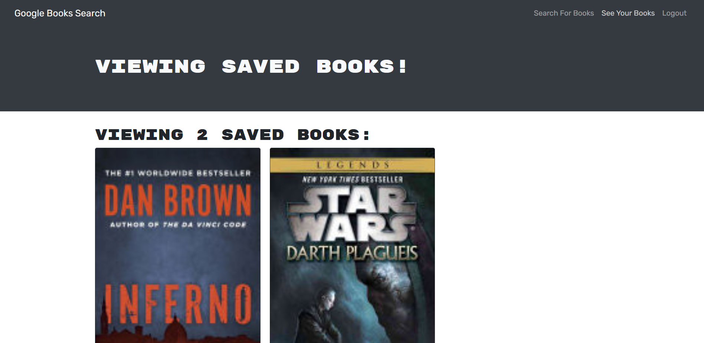

# book-search-engine

## Description
This application enables users to search for books using Google Books, and save their book searches to be viewed later. The application was built using the MERN stack. The application was originally built by The Coding Bootcamp (https://github.com/coding-boot-camp), but I refactored it to use a GraphQL API with an Apollo server instead of a RESTful API.

## Table of Contents

- [Installation](#installation)
- [Usage](#usage)
- [License](#license)
- [Contributing](#contributing)
- [Tests](#tests)
- [Questions](#questions)

## Installation
This project does not require installation. Instead you can view the website at https://guarded-beach-39574.herokuapp.com/

## Usage
In order to search for books, you can enter the search information (for example, the name of the book) into the search bar, and click the "Submit Search" button. In order to save your books, you will first need to signup/login, which you can do using the button in the header. When signing up, you will be asked for a username, email, and password. To login you will have to enter your email and password. Once you are logged in, you can save a book you have searched for by clicking on the "Save this Book!" button. You can view your saved books by clicking on the "See Your Books" button in the header. You can also delete saved books from that page.

## License

    This project is licensed under GNU AGPLv3. You can read more about the license here: 
    

## Contributing
I am not looking for contributers on this project

## Tests
There are no built-in tests for this application

## Questions
If you would like to contact me with any questions about the application, my GitHub username is PatrickLQuirk and my email is patrickliamquirk@yahoo.com
